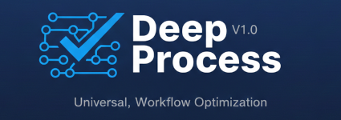

# Deep Process




A collection of structured workflows that make LLMs actually think instead of just respond.

## Why this exists

LLMs are incredibly capable - until they're not. Ask one to verify your code and it says "looks good." Ask it to assess risks and you get the same five generic risks every time. Ask it to design architecture and you get a clean diagram with hidden contradictions.

The problem isn't intelligence. It's that LLMs default to being agreeable and fast. They skip steps, take shortcuts, and produce outputs that *look* thorough but aren't. They summarize instead of synthesize. They list risks instead of tracing cascades. They say "yes, that's feasible" without checking if your timeline is realistic or your team has the right skills.

Deep Process fixes this by giving the LLM a structured protocol to follow - specific steps, quality gates, adversarial checks, and bias corrections. The LLM still does the thinking, but the process ensures it actually *does* the thinking instead of pattern-matching to "what a good answer looks like."

## What you get

Each process produces a structured, evidence-based deliverable - not conversation, not hand-waving. Scored assessments, traceable findings, falsifiable conclusions. The kind of output you can actually act on.

## Quick start

```bash
npx deep-process init
```

The interactive installer will:
1. Copy process files to `_deep-process/` in your project
2. Detect which AI tools you use (Claude, Gemini, Cursor, etc.)
3. Generate properly configured commands for each tool
4. Optionally add `_deep-process/` to `.gitignore`

Then open your AI tool and run:

```
/deep-verify Check the API in src/api/ against the spec in docs/requirements.md
```

### Non-interactive mode

```bash
npx deep-process init --yes --tools claude,gemini
```

### Other commands

```bash
npx deep-process status       # Show what's installed
npx deep-process add-tool cursor   # Add a tool integration
npx deep-process remove-tool cursor # Remove a tool integration
npx deep-process update       # Update processes to latest versions
npx deep-process uninstall    # Remove everything
```

## The processes

### [Deep Verify](processes/deep-verify/docs/README.md) - Check if something is correct

You wrote code, received a document, or generated something with an LLM. Is it actually correct? Deep Verify traces assumptions, finds contradictions, matches against impossibility patterns, and runs adversarial review on its own findings. Output: a structured report with exact quotes, a numeric score, and a verdict.

```
/deep-verify Check this API implementation against the requirements in docs/spec.md
```

### [Deep Explore](processes/deep-explore/docs/README.md) - Think through a decision

You're stuck. You don't know what to do, or you have too many options and can't see clearly. Deep Explore separates facts from assumptions, discovers options you weren't considering, turns vague fears into specific concerns, and tells you when you're ready to decide.

```
/deep-explore Should we build this in-house or buy an existing solution?
```

### [Deep Architect](processes/deep-architect/docs/README.md) - Design software architecture

You need to build something and you need a solid plan. Deep Architect runs 16 operations - 8 that build the design (decomposition, boundaries, dependencies...) and 8 that try to break it (STRIDE, FMEA, anti-patterns, pre-mortem...). The adversarial phase is where the real value is.

```
/deep-architect Design the architecture for a real-time notification service
```

### [Deep Feasibility](processes/deep-feasibility/docs/README.md) - Find out if it can be done

Before committing resources, find out if the plan is realistic. Deep Feasibility checks 10 dimensions (technical, resource, knowledge, organizational, temporal, compositional, economic, scale, cognitive, dependency) and gives you a GO / CONDITIONAL GO / NO-GO verdict with confidence levels. Includes planning fallacy detection.

```
/deep-feasibility Can we migrate to microservices in 6 months with a team of 4?
```

### [Deep Risk](processes/deep-risk/docs/README.md) - Find the risks you're not seeing

Standard risk lists are useless. Deep Risk discovers risks through theory-grounded analysis, scores them on 5 dimensions (probability, impact, velocity, detectability, reversibility), and - critically - maps how risks interact, cascade, and amplify each other. Includes Cobra Effect checks on proposed mitigations.

```
/deep-risk Assess the risks of our cloud migration project
```

### [Deep Synthesis](processes/deep-synthesis/docs/README.md) - Turn sources into understanding

You have multiple sources, perspectives, or knowledge fragments. You need to understand what they mean *together*, not just what each one says. Deep Synthesis finds patterns across sources, resolves contradictions by finding the conditions under which each view is correct, and produces compressed understanding that passes the Shannon Test: does this insight require combining sources?

```
/deep-synthesis Synthesize these research papers on distributed consensus approaches
```

### [Deep Document](processes/deep-document/docs/README.md) - Generate documentation from code

You need documentation, but you need it to be *accurate*. Deep Document inventories the codebase, extracts domain ontology, plans the docs, gathers evidence (file + line number for every claim), and then generates. Every statement in the output traces back to actual code. It won't make things up.

```
/deep-document
```

## Supported tools

The installer generates commands for **11 AI tools**:

| Tool | Format | Generated files |
|------|--------|----------------|
| **Claude Code** | Markdown | `.claude/commands/*.md` |
| **Gemini CLI** | TOML | `.gemini/commands/*.toml` |
| **Cursor** | Markdown | `.cursor/commands/*.md` |
| **Continue.dev** | Prompt | `.continue/prompts/*.prompt` |
| **GitHub Agents** | Markdown | `.github/agents/*.agent.md` |
| **AGENTS.md** | Markdown | `AGENTS.md` (marker-based) |
| **Cline** | Markdown | `.clinerules/*.md` |
| **Windsurf** | Markdown | `.windsurf/rules/*.md` |
| **Roo Code** | Markdown | `.roo/rules-{slug}/*.md` |
| **GitHub Copilot** | Markdown | `.github/copilot-instructions.md` (marker-based) |
| **Aider** | Markdown + YAML | `.aider/conventions/*.md` + `.aider.conf.yml` |

Auto-detection: The installer scans your project for existing tool configurations and pre-selects detected tools.

## Which process do I need?

| You're thinking... | Use this |
|---|---|
| "Is this code/document actually correct?" | [Deep Verify](processes/deep-verify/docs/README.md) |
| "I don't know what to do" | [Deep Explore](processes/deep-explore/docs/README.md) |
| "I need to design this system" | [Deep Architect](processes/deep-architect/docs/README.md) |
| "Can we actually pull this off?" | [Deep Feasibility](processes/deep-feasibility/docs/README.md) |
| "What could go wrong?" | [Deep Risk](processes/deep-risk/docs/README.md) |
| "I have lots of info but no understanding" | [Deep Synthesis](processes/deep-synthesis/docs/README.md) |
| "We need proper documentation" | [Deep Document](processes/deep-document/docs/README.md) |

## How they work together

These processes aren't isolated. A typical flow might look like:

1. **Explore** the decision space to understand your options
2. **Assess feasibility** of your top option
3. **Identify risks** and plan mitigations
4. **Design the architecture** with those constraints in mind
5. **Verify** the architecture against your requirements
6. **Document** the result

You don't have to use them all. Each process works standalone. But when combined, the output of one naturally feeds into the next.

## License

MIT
