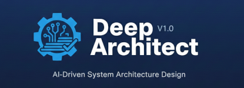

# Deep Architect



A structured architecture design workflow that takes you from a vague idea to a verified, executable architecture plan.

## The problem

When I asked LLMs to "design the architecture" for a project, I'd get something that looked professional but fell apart under scrutiny. The component diagram would look clean, but responsibilities would overlap. The API design would seem reasonable, but the dependency graph would have hidden cycles. The quality attributes would be listed, but nobody had checked if they actually conflicted with each other.

The real issue wasn't that the LLM couldn't think about architecture. It's that architecture requires adversarial thinking - someone needs to try to break the design before it gets built. LLMs default to being helpful and agreeable, which is exactly the wrong mode for finding structural flaws.

## What this is

Deep Architect is a prompt-based workflow that forces the LLM to design software architecture through 16 operations - 8 that build the design, and 8 that try to break it:

1. **Build phase (8 canonical operations):** Decomposition, boundary definition, relationship mapping, responsibility assignment, dependency analysis, pattern selection, quality attribute analysis, interface design
2. **Break phase (8 adversarial operations):** STRIDE threat modeling, FMEA failure analysis, bottleneck detection, anti-pattern scanning, complexity assessment, compliance checking, pre-mortem analysis, trade-off validation
3. **Validation:** The top 10 critical issues get verified, not just listed
4. **Verification:** The final architecture is checked against the original requirements

The output is a complete architecture model with artifacts, trade-off analysis, and a verification report - not a hand-wavy diagram.

## How to use it

You need an LLM CLI like Claude Code, Gemini CLI, or similar.

**Quickest way** - use the built-in slash command:

```
/deep-architect I need to design a microservices architecture for an e-commerce platform
```

Or point the LLM to the workflow directly:

```
Use the process in src/deep-architect/workflow.md to design the architecture for my project
```

The process will start by assessing your context (domain, team size, stability requirements) and then walk through each phase interactively.

## What it's good at

- Turning a rough idea into a structured, defensible architecture
- Finding conflicts between quality attributes before they become problems
- Catching dependency cycles, responsibility overlaps, and boundary violations
- Stress-testing designs with threat modeling and failure analysis
- Producing architecture artifacts that can actually guide implementation

## Limitations

This isn't magic. Some things to know:

- **Scope matters.** It works best for a single system or service. Trying to architect an entire enterprise in one pass will hit depth limits.
- **It needs input.** The better you describe your constraints (team size, timeline, existing tech), the better the output. Vague briefs produce generic architectures.
- **Adversarial phase takes time.** The 8 adversarial operations are thorough. If you're in a hurry, you might be tempted to skip them - don't. That's where the real value is.
- **LLM limitations apply.** Domain-specific architectural patterns (e.g., telecom, medical devices) depend on the model's training data. Verify against domain standards.

## Example output

```
ARCHITECTURE: E-commerce Order Processing Service

CANONICAL OPERATIONS COMPLETED: 8/8
  Decomposition: 6 bounded contexts identified
  Boundaries: API gateway, event bus, 3 internal boundaries
  Dependencies: 14 edges, 0 cycles detected

ADVERSARIAL FINDINGS:
  STRIDE: 3 threats (2 mitigated, 1 accepted with monitoring)
  FMEA: Payment timeout cascade - RPN 280 (HIGH)
  Anti-pattern: Distributed monolith risk in inventory-order coupling

TRADE-OFF ANALYSIS:
  Consistency vs. Availability: Chose eventual consistency for order status
  Latency vs. Throughput: Async processing for non-critical paths

VERDICT: ARCHITECTURE VALIDATED (7 of 10 critical issues resolved, 3 accepted)
```

## Works well with

- Greenfield projects that need solid foundations
- Major refactoring efforts (design the target state first)
- System design reviews (run adversarial phase on existing architecture)
- Technical proposals that need rigor before presenting to stakeholders

## Related processes

| Process | Purpose | When to use |
|---------|---------|-------------|
| **Deep Architect** | Design architecture | You need to build something |
| **Deep Verify** | Verify artifact correctness | You have something to check |
| **Deep Feasibility** | Assess feasibility | You're not sure it can be done |
| **Deep Risk** | Assess risks of a plan | You have a plan, want to stress-test it |
| **Deep Explore** | Explore decision space | You don't know what to do |
| **Deep Synthesis** | Synthesize knowledge | You have many sources, need understanding |
| **Deep Document** | Generate documentation | You need structured docs from a codebase |

## License

MIT
