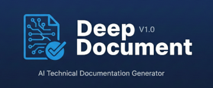

# Deep Document


A structured documentation generation workflow that produces complete, evidence-based documentation from any codebase.

## The problem

When I asked LLMs to "write documentation for this project," I'd get something that was either a shallow overview that restated the README, or a hallucinated deep-dive that described code that didn't exist. The LLM would invent API endpoints, make up configuration options, and describe architectural patterns that weren't actually in the codebase.

Even when the output was accurate, it was rarely useful. A giant wall of text with no structure, no cross-references, and no way to tell which parts were based on actual code analysis vs. the model guessing.

I needed documentation that was grounded in evidence - every claim traceable to a specific file and line number.

## What this is

Deep Document is a prompt-based workflow that forces the LLM to generate documentation through a systematic, evidence-first pipeline:

1. **Inventory the codebase** - scan files, detect technologies, build a map of what actually exists
2. **Extract ontology** - identify the domain concepts, their relationships, and the vocabulary the code uses
3. **Analyze templates** - match the codebase against documentation templates to determine what's relevant
4. **Plan before writing** - create a documentation plan and get your approval before generating anything
5. **Gather evidence** - collect specific code references (file, line, quote) for every claim
6. **Generate with citations** - produce documentation where every statement links back to source code

The output is structured documentation with evidence maps, not prose generated from vibes.

## How to use it

You need an LLM CLI like Claude Code, Gemini CLI, or similar.

**Quickest way** - use the built-in slash command:

```
/deep-document
```

It will scan for existing projects or offer to start a new one. Or point it at a specific codebase:

```
/deep-document Generate documentation for the src/api/ directory
```

The process is interactive - it will show you the documentation plan and ask for approval before generating content.

## What it's good at

- Producing documentation that's actually grounded in the code (not hallucinated)
- Detecting project type automatically (serverless, Terraform, standard app, etc.)
- Creating cross-referenced docs with evidence trails
- Resuming interrupted documentation sessions (it saves state)
- Handling multi-technology projects (detects languages, frameworks, patterns)

## Limitations

This isn't magic. Some things to know:

- **It takes time.** Thorough documentation requires reading a lot of code. For large codebases, expect multiple sessions.
- **It's conservative.** It won't document what it can't verify. This means some implicit behaviors might be missed, but nothing will be made up.
- **Template-driven.** The output follows predefined templates (architecture, API reference, deployment guide, etc.). Good for standard docs, less flexible for unusual formats.
- **Requires reviews.** The process has built-in review checkpoints. Skipping them reduces quality.

## Example output

```
DEEP DOCUMENT — SESSION STATUS

Repository: my-api-service
State: EVIDENCE_GATHERING (Step 8 of 15)
Coverage: 73% of planned sections have evidence

DOCUMENTATION PLAN (approved):
  [1] Project Overview        — 12 evidence items collected
  [2] Architecture            — 8 evidence items, 2 gaps identified
  [3] API Reference           — 23 endpoints documented (verified)
  [4] Data Models             — 7 models with field-level docs
  [5] Deployment Guide        — 4 evidence items, needs review

EVIDENCE QUALITY:
  Direct code reference: 87%
  Config file reference: 9%
  Inferred (marked):     4%
```

## Works well with

- Onboarding new team members (generate project overview + architecture docs)
- Open source projects that need proper documentation
- Legacy codebases where knowledge has been lost
- Pre-audit documentation (everything is evidence-backed)
- API documentation with verified endpoint listings

## Related processes

| Process | Purpose | When to use |
|---------|---------|-------------|
| **Deep Document** | Generate documentation | You need structured docs from a codebase |
| **Deep Verify** | Verify artifact correctness | You have docs to check for accuracy |
| **Deep Architect** | Design architecture | You need to design before documenting |
| **Deep Explore** | Explore decision space | You're not sure what to document |

## License

MIT
