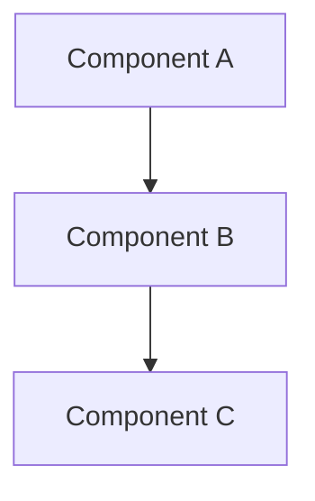

# STATE_SYNTHESIS

**Input:** evidence_map.yaml, documentation-plan.yaml, domain-ontology.yaml, diagram-triggers.yaml
**Output:** architectural-model.json, dependency-closure.yaml

## ENFORCED SEQUENCE

**STEP 1: LOAD_EVIDENCE**
1. Read evidence_map.yaml → extract all claims[] with type: relationship|behavior
2. Read documentation-plan.yaml → extract diagram_plan[]
3. Read domain-ontology.yaml → extract entities[]
4. Load diagram-triggers.yaml from data/patterns/ (for STEP 7 diagram generation)

**STEP 2: ASSUMPTIONS_DECLARED**
```yaml
assumptions:
  - "Component types: module|service|function|class|interface|config|external"
  - "Layers: presentation|business|data|infrastructure|integration"
  - "Relationship types: uses|contains|extends|implements|calls|subscribes|publishes|depends_on"
  - "Topology metrics: betweenness, closeness, degree, pagerank (Method #90)"
  - "High-priority threshold: top 20% (percentile >= 0.80)"
  - "Diagram coverage target: >= 0.90"
  - "Method #159 transitive closure: Floyd-Warshall O(N³)"
  - "Timeout: 10 minutes (600000ms) for closure computation"
  - "Fallback: direct dependencies only if timeout exceeded"
```

**STEP 3: EXTRACT_COMPONENTS**
From evidence claims and ontology entities:
1. For each entity in domain-ontology.yaml:
   - Create component entry
   - Assign component_id (sequential: CMP_001, CMP_002, ...)
   - Determine component_type (from entity.type)
   - Classify layer (analyze entity source files and imports)
   - Link source_segments (from coverage_map)
   - Link evidence_claims (from evidence_map)

**STEP 4: EXTRACT_RELATIONSHIPS**
From evidence claims with type: relationship|behavior:
1. Parse claim_text to identify source and target components
2. Create relationship entry:
   - Assign relationship_id (sequential: REL_001, REL_002, ...)
   - Record source_component_id, target_component_id
   - Classify relationship_type
   - Link evidence_claim_ids (citations)

**STEP 5: BUILD_GRAPH**
Create adjacency matrix for topology calculation:
```
graph[component_i][component_j] = 1 if relationship exists, 0 otherwise
```

Build dependency closure using Method #159 Transitive Closure:
- Start timer
- Floyd-Warshall algorithm:
  ```
  for k in 1..N:
    for i in 1..N:
      for j in 1..N:
        if adjacency[i][k] AND adjacency[k][j]:
          adjacency[i][j] = true
  ```
- If elapsed_time >600000ms → ABORT, use direct dependencies only, log LIMITATION

**STEP 6: CALCULATE_TOPOLOGY** (Method #90)
For each component, calculate:

**6.1: Betweenness Centrality**
Number of shortest paths passing through component / total shortest paths
Weight: 0.30 per config.yaml

**6.2: Closeness Centrality**
1 / (average distance to all other components)
Weight: 0.25

**6.3: Degree Centrality**
(in-degree + out-degree) / (total components - 1)
Weight: 0.25

**6.4: PageRank**
Iterative algorithm: rank = (1-d)/N + d * sum(rank_incoming / out_degree_incoming)
Damping factor d = 0.85
Weight: 0.20

**6.5: Composite Score**
```
composite = 0.30*betweenness + 0.25*closeness + 0.25*degree + 0.20*pagerank
```

**6.6: Identify High-Priority**
Sort by composite score, select top 20% (percentile >= 0.80)

**STEP 7: GENERATE_DIAGRAMS**
For each diagram in documentation-plan.yaml diagram_plan:

**7.1: Apply Diagram Triggers**
Check trigger conditions from diagram-triggers.yaml:
- Example: DT-CDK-STACK (if aws-cdk domain, generate stack diagram)
- Example: DT-DYNAMODB-SCHEMA (if >5 DynamoDB tables, generate schema)

**7.2: Select Components**
Based on diagram type and high-priority components:
- **component**: show top 20% by composite score
- **sequence**: show call chains for high-priority functions
- **deployment**: show infrastructure components
- **class**: show type hierarchy
- **data_flow**: show data transformations
- **architecture**: show full system layers

**7.3: Generate Mermaid Code**

Syntax validation:
- Verify node IDs match components[]
- Verify relationship arrows match relationships[]
- Verify mermaid syntax valid (graph/flowchart/sequence/class keywords)

**7.4: Store Diagram**
```json
{
  "diagram_id": "DIAG_001",
  "diagram_type": "component",
  "title": "High-Level Architecture",
  "components": ["CMP_001", "CMP_002", ...],
  "relationships": ["REL_001", "REL_002", ...],
  "mermaid_code": "graph TD\n  ..."
}
```

**STEP 8: VERIFY_COVERAGE**
```
coverage_ratio = components_in_diagrams / total_components
```
Must be >= 0.90 per GATE_3

**STEP 9: VERIFY**
1. Method #85 Grounding: sample 3 components, verify source_segments exist in coverage_map
2. Method #168 Phantom Hunt: check for phantom relationships (component_ids not in components[])
3. Method #84 Coherence: verify all diagram component_ids reference components[] array
4. PD-UNIVERSAL: Scan diagram labels/descriptions for 68+ placeholder patterns

**STEP 10: RENDER**
Write deep-artifacts/architectural-model.json per schema:
```json
{
  "metadata": {
    "synthesis_timestamp": "<ISO8601>",
    "total_components": 45,
    "total_relationships": 78,
    "total_diagrams": 12,
    "synthesis_duration_ms": 15000
  },
  "components": [...],
  "relationships": [...],
  "diagrams": [...],
  "topology_metrics": {
    "centrality_scores": {...},
    "high_priority_components": [...],
    "diagram_coverage": {
      "total_components": 45,
      "components_in_diagrams": 42,
      "coverage_ratio": 0.93
    }
  }
}
```

Write deep-artifacts/dependency-closure.yaml (transitive closure result, limitations if timeout)

**STEP 11: COUNTER-CHECKS**
- **CC1 (Method #85 Grounding):** Sample 3 components, verify evidence_claim_ids exist in evidence_map → BLOCKER if fail
- **CC2 (Method #168 Phantom + PD-UNIVERSAL):** Scan diagrams for phantoms/placeholders → BLOCKER if detected
- **CC3 (Method #84 Coherence):** Verify all relationship component_ids reference components[] array → ERROR if orphaned

**STEP 12: GATE_3 CHECKLIST** ← BINDING
```
[ ] G3-01: architectural-model.json exists (BLOCKER)
[ ] G3-02: Diagrams generated per plan (BLOCKER)
[ ] G3-03: Each diagram has source evidence (CRITICAL)
[ ] G3-04: Diagram types appropriate (ERROR)
[ ] G3-05: No phantom diagrams (PD-UNIVERSAL) (BLOCKER)
[ ] G3-06: Counter-checks executed (ERROR)
[ ] G3-07: Synthesis version incremented (WARNING)
[ ] G3-08: Delta math correct (ERROR)
[ ] G3-09: Dependency closure complete (Method #159) (WARNING - fallback OK)
[ ] G3-10: Topology metrics computed (Method #90) (WARNING)
```

**STEP 13: TRANSITION**
- IF all BLOCKER/CRITICAL conditions PASS → USER_REVIEW_DIAGRAMS
- IF any BLOCKER/CRITICAL FAIL → STATE_ERROR
- NOTE: G3-09, G3-10 are WARNING - can proceed with limitations logged

---

## INCREMENTAL MODE (V6.3)

### INCREMENTAL_SYNTHESIS

**STEP 1: LOAD_BASE**
Read existing architectural-model.json

**STEP 2: DETECT_CHANGES**
Compare evidence_map.yaml with base model
Identify: new claims (new components/relationships), modified claims, deleted claims

**STEP 3: SUPPLEMENT**
For new/modified:
1. Add new components OR update existing
2. Add new relationships
3. Generate new diagrams if triggers met
4. Preserve all unchanged components/relationships (>=80% preservation required)

**STEP 4: RECALCULATE_TOPOLOGY**
Recalculate centrality scores for entire graph (topology is global, not local)

**STEP 5: WRITE_DELTA**
Write deep-artifacts/synthesis-incremental-delta.yaml

**STEP 6: GATE_3_INCREMENTAL_VERIFY**
Evaluate gate conditions for incremental mode
