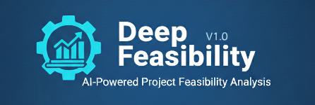

# Deep Feasibility


A structured feasibility assessment workflow that tells you whether something can actually be done - and where the real blockers are.

## The problem

When I asked "is this feasible?" I'd get one of two answers: enthusiastic "yes, absolutely!" (with no analysis of what could go wrong) or vague "it depends" (with no structure for figuring out what it depends on).

The real danger wasn't being told "no" - it was being told "yes" without anyone checking. Projects fail not because someone said "this is impossible" but because nobody checked whether the team had the skills, the timeline was realistic, the dependencies were available, or the organizational structure could support the work.

I needed a way to systematically check feasibility across multiple dimensions, not just ask "does the technology exist?"

## What this is

Deep Feasibility is a prompt-based workflow that forces the LLM to assess feasibility across 10 dimensions:

1. **Technical** - Does the technology exist and is it mature enough?
2. **Resource** - Do you have the people, money, and infrastructure?
3. **Knowledge** - Does the team know how to do this?
4. **Organizational** - Can the org structure support this?
5. **Temporal** - Is the timeline realistic?
6. **Compositional** - Do all the pieces work together?
7. **Economic** - Does the business case hold up?
8. **Scale** - Will it work at the required scale?
9. **Cognitive** - Is the complexity manageable for the team?
10. **Dependency** - Are external dependencies available and stable?

Each dimension gets a scored assessment. The process includes constraint analysis, validation methods, and bias checks (like planning fallacy detection and Dunning-Kruger correction).

The output is a feasibility verdict with confidence levels - GO, CONDITIONAL GO, or NO-GO - backed by evidence, not gut feeling.

## How to use it

You need an LLM CLI like Claude Code, Gemini CLI, or similar.

**Quickest way** - use the built-in slash command:

```
/deep-feasibility Can we migrate our monolith to microservices in 6 months with a team of 4?
```

Or point the LLM to the workflow directly:

```
Use the process in src/deep-feasibility/workflow.md to assess the feasibility of [your proposal]
```

The process will ask you to select a depth level (quick, standard, comprehensive, or critical) and then walk through each dimension interactively.

## What it's good at

- Catching the dimensions people forget to check (organizational, cognitive, dependency)
- Detecting planning fallacy before it ruins your timeline
- Finding hard constraints vs. soft constraints (what's truly impossible vs. what's just difficult)
- Surfacing contradictions in proposals ("we'll move fast AND be thorough")
- Giving you a structured basis for GO/NO-GO decisions

## Limitations

This isn't magic. Some things to know:

- **Depth vs. speed trade-off.** Quick mode gives you a directional answer in minutes. Critical mode takes hours but catches subtle issues. Choose based on the stakes.
- **Quality of input matters.** "Can we build an app?" is too vague. "Can our 3-person team build a real-time trading platform with sub-millisecond latency in 4 months?" gives the process something to work with.
- **It assesses, it doesn't decide.** A CONDITIONAL GO still requires you to decide whether the conditions are acceptable.
- **LLM knowledge limits.** Niche technology feasibility (e.g., specific hardware constraints) should be validated with domain experts.

## Example output

```
FEASIBILITY ASSESSMENT: Migrate monolith to microservices

DEPTH: Standard
VERDICT: CONDITIONAL GO (confidence: 0.65)

DIMENSION SCORES (1-5):
  Technical:      4.0  — Technology mature, team has partial experience
  Resource:       2.5  — BLOCKER: Need 2 more backend engineers
  Knowledge:      3.0  — Gap in distributed tracing, trainable
  Organizational: 2.0  — WARNING: No DevOps culture, requires change management
  Temporal:       1.5  — BLOCKER: 6 months unrealistic, minimum 12 months
  Compositional:  3.5  — Service boundaries clear, data migration complex
  Economic:       4.0  — ROI positive at 18-month horizon
  Scale:          4.5  — Target scale well within microservices sweet spot
  Cognitive:      3.0  — Team can handle 4-6 services, not 15+
  Dependency:     3.5  — All dependencies available, 2 need version upgrades

CONDITIONS FOR GO:
  1. Extend timeline to 12 months (currently 6 - planning fallacy detected)
  2. Hire 2 backend engineers with distributed systems experience
  3. Limit initial scope to 4-6 services (not full decomposition)
  4. Invest in DevOps culture change (CI/CD, monitoring) before migration

BIAS CHECK: Planning fallacy detected (Hofstadter correction applied: +100% timeline)
```

## Works well with

- Project proposals that need a reality check
- Technology migration decisions
- Startup idea validation (before committing resources)
- Resource planning (finding out what you actually need)
- Vendor/build-vs-buy decisions

## Related processes

| Process | Purpose | When to use |
|---------|---------|-------------|
| **Deep Feasibility** | Assess feasibility | You're not sure it can be done |
| **Deep Risk** | Assess risks of a plan | You know it's feasible, want to find risks |
| **Deep Architect** | Design architecture | It's feasible, now design it |
| **Deep Explore** | Explore decision space | You don't know what to do yet |
| **Deep Verify** | Verify artifact correctness | You have something to check |

## License

MIT
