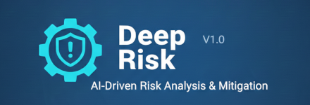

# Deep Risk


A structured risk assessment workflow that finds the risks you're not thinking about - and the ways they interact.

## The problem

When I asked LLMs to "identify risks," I'd get the same generic list every time: scope creep, budget overruns, key person dependency. True, but useless. These are risks everyone already knows about.

The dangerous risks are the ones nobody's looking at. The cascade where a small delay in one component triggers a deadline miss in another. The dependency that seems stable until the vendor changes their pricing model. The assumption buried so deep in the plan that nobody thinks to question it.

Standard risk assessments also ignore interactions. Risks don't exist in isolation - they amplify each other, create cascades, and sometimes cancel out. A risk matrix with independent probabilities misses the real picture.

## What this is

Deep Risk is a prompt-based workflow that forces the LLM to systematically discover, quantify, and connect risks:

1. **Ground** - Understand the context using theory (Swiss Cheese, Cynefin, Normal Accident Theory) instead of just brainstorming
2. **Identify vertically** - Find risks within each domain area (technical, organizational, external)
3. **Identify horizontally** - Find risks that cross boundaries (cascades, hidden dependencies)
4. **Quantify** - Score each risk on 5 dimensions: Probability, Impact, Velocity, Detectability, Reversibility
5. **Analyze interactions** - Map how risks amplify, trigger, or correlate with each other
6. **Design mitigations** - Create response plans with Cobra Effect checks (will the fix create new problems?)
7. **Establish monitoring** - Set up leading indicators, not just lagging metrics

It includes crisis mode detection - if you describe an active emergency, it skips the theory and goes straight to identify-mitigate-monitor.

The output is a risk register with interaction maps and a monitoring dashboard, not a static list that gets filed away.

## How to use it

You need an LLM CLI like Claude Code, Gemini CLI, or similar.

**Quickest way** - use the built-in slash command:

```
/deep-risk Assess the risks of our cloud migration project
```

Or point the LLM to the workflow directly:

```
Use the process in src/deep-risk/workflow.md to assess risks for [your project/plan]
```

The process will ask you to select a depth level (quick, standard, comprehensive, or critical) and adapt its analysis accordingly.

## What it's good at

- Finding risks that cross organizational boundaries
- Mapping risk interactions (cascades, correlations, amplification loops)
- Catching Cobra Effects in proposed mitigations
- Distinguishing fast-moving risks (high velocity) from slow burns
- Setting up leading indicators that warn you before risks materialize
- Crisis mode for active incidents (skip analysis, focus on response)

## Limitations

This isn't magic. Some things to know:

- **Depth vs. speed trade-off.** Quick mode gives you the top 10 risks in an hour. Critical mode with chaos probes takes days but finds subtle interaction effects.
- **Domain knowledge matters.** The process uses pattern libraries (core, distributed systems, data engineering, enterprise, project management) but won't catch risks unique to your industry without context.
- **Quantification is subjective.** The 5D scoring provides structure, but the numbers reflect the LLM's assessment. Use them for relative comparison, not as precise measurements.
- **Risk interactions are combinatorial.** With 20+ risks, the number of possible interactions explodes. The process focuses on the most plausible ones.

## Example output

```
DEEP RISK ASSESSMENT: Cloud Migration Project

DEPTH: Standard
RISKS IDENTIFIED: 23 (8 critical, 10 important, 5 minor)

TOP 5 BY COMPOSITE SCORE:
  R-001: Vendor lock-in cascade          P:4 I:5 V:2 D:2 R:1  Score: 8.7
  R-002: Data migration corruption       P:3 I:5 V:4 D:3 R:2  Score: 7.9
  R-003: Team skill gap (Kubernetes)     P:4 I:4 V:3 D:4 R:3  Score: 7.2
  R-004: Cost overrun (egress fees)      P:5 I:3 V:2 D:4 R:4  Score: 6.8
  R-005: Compliance gap during migration P:3 I:5 V:3 D:2 R:2  Score: 6.5

INTERACTION MAP:
  R-003 → R-002: Skill gap increases data corruption probability (+15%)
  R-001 + R-004: Vendor lock-in amplifies cost overrun (correlation: 0.7)
  R-005 → ALL: Compliance gap can halt entire migration (cascade trigger)

COBRA EFFECT CHECK:
  Mitigation "hire contractors for K8s" → creates R-011 (knowledge drain when
  contractors leave). Recommend: pair programming + internal training instead.

MONITORING DASHBOARD:
  Leading indicator for R-001: % of services using vendor-specific APIs (threshold: 30%)
  Leading indicator for R-003: Sprint velocity trend (threshold: -20% over 3 sprints)
```

## Works well with

- Project planning (find risks before they find you)
- Architecture reviews (stress-test a design's risk profile)
- Go/no-go decisions (understand what you're accepting)
- Incident retrospectives (map the cascade that led to failure)
- Portfolio risk management (aggregate risks across projects)

## Related processes

| Process | Purpose | When to use |
|---------|---------|-------------|
| **Deep Risk** | Assess risks of a plan | You have a plan, want to stress-test it |
| **Deep Feasibility** | Assess feasibility | You're not sure it can be done at all |
| **Deep Architect** | Design architecture | You need to build something (then risk-assess it) |
| **Deep Verify** | Verify artifact correctness | You have something to check |
| **Deep Explore** | Explore decision space | You don't know what to do yet |

## License

MIT
