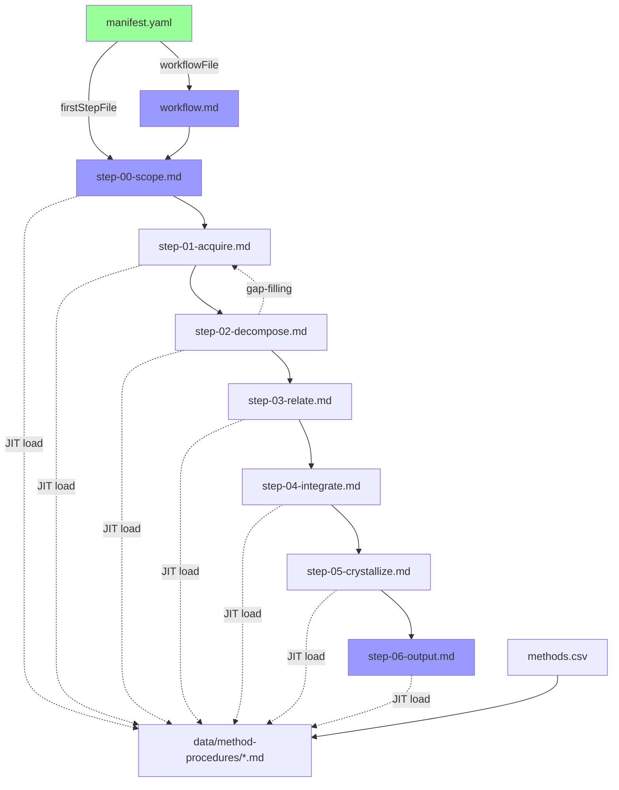

# Deep Synthesis V2.0 Cleanup Plan

**Date:** 2026-02-15
**Purpose:** Usunięcie V1.1 i uczynienie V2.0 jedyną wersją procesu
**Methods Applied:** #083 Closure Check, #090 Dependency Topology Mapping, #084 Coherence Check

---

## Analiza Stanu Obecnego

### V1.1 Files (DO USUNIĘCIA)
| Plik | Rozmiar | Zależności | Powód usunięcia |
|------|---------|------------|-----------------|
| `workflow.md` | 170 linii | → reference.md, → step-*.md | Deprecated, zastąpiony przez workflow-v2.md |
| `reference.md` | 200 linii | Brak | Dokumentacja teoretyczna, narusza Zasadę 0 (tylko execution) |
| `process.yaml` | V1.1 def | → workflow.md | Definicja V1.1, manifest.yaml jest aktywny |
| `ANALYSIS.md` | Analiza | Brak | Dokument przejściowy, analiza V1→V2 |
| `steps/step-00-scope.md` | 19 KB | V1.1 workflow | Zastąpiony przez step-00-scope-v2.md |
| `steps/step-01-acquire.md` | 23 KB | V1.1 workflow | Zastąpiony przez step-01-acquire-v2.md |
| `steps/step-02-decompose.md` | 30 KB | V1.1 workflow | Zastąpiony przez step-02-decompose-v2.md |
| `steps/step-03-relate.md` | 35 KB | V1.1 workflow | Zastąpiony przez step-03-relate-v2.md |
| `steps/step-04-integrate.md` | 36 KB | V1.1 workflow | Zastąpiony przez step-04-integrate-v2.md |
| `steps/step-05-crystallize.md` | 28 KB | V1.1 workflow | Zastąpiony przez step-05-crystallize-v2.md |
| `steps/step-06-output.md` | 32 KB | V1.1 workflow | Zastąpiony przez step-06-output-v2.md |

**Total V1.1 files:** 11 plików

### V2.0 Files (DO ZACHOWANIA I PRZEMIANOWANIA)
| Plik obecny | Nowa nazwa | Wymaga aktualizacji? |
|-------------|------------|----------------------|
| `workflow-v2.md` | `workflow.md` | NIE (już referencje bez -v2) |
| `README-V2.md` | `README.md` | TAK (aktualizacja referencji) |
| `steps/step-00-scope-v2.md` | `steps/step-00-scope.md` | TAK (LOAD commands) |
| `steps/step-01-acquire-v2.md` | `steps/step-01-acquire.md` | TAK (LOAD commands) |
| `steps/step-02-decompose-v2.md` | `steps/step-02-decompose.md` | TAK (LOAD commands) |
| `steps/step-03-relate-v2.md` | `steps/step-03-relate.md` | TAK (LOAD commands) |
| `steps/step-04-integrate-v2.md` | `steps/step-04-integrate.md` | TAK (LOAD commands) |
| `steps/step-05-crystallize-v2.md` | `steps/step-05-crystallize.md` | TAK (LOAD commands) |
| `steps/step-06-output-v2.md` | `steps/step-06-output.md` | TAK (LOAD commands) |

**Total V2.0 files:** 9 plików

### Shared Files (BEZ ZMIAN)
- `manifest.yaml` - wymaga aktualizacji (workflowFile, firstStepFile)
- `methods.csv` - bez zmian
- `CHANGELOG.md` - bez zmian (historyczny rekord)
- `data/**` - wszystkie pliki bez zmian (41 method procedures, templates, scoring, foundations)
- `meta/**` - bez zmian
- `docs/**` - bez zmian (excluded from install)

---

## Znalezione Problemy (Coherence Check)

### Problem #1: Niespójność w referencjach workflow-v2.md
**FINDING:** workflow-v2.md zawiera referencje do `step-00-scope.md` przez `step-06-output.md` (BEZ sufiksu -v2), ale faktyczne pliki mają sufiks `-v2`.

**QUOTE:**
```
workflow-v2.md:6: 1. LOAD steps/step-00-scope.md
workflow-v2.md:57: step-00-scope.md
```

**Faktyczna nazwa:** `steps/step-00-scope-v2.md`

**RESOLUTION:** Po przemianowaniu plików problem zostanie rozwiązany automatycznie.

### Problem #2: manifest.yaml excludeFromInstall zawiera pliki do usunięcia
**FINDING:** manifest.yaml już identyfikuje pliki V1.1 jako wykluczone z instalacji, potwierdzając że są deprecated.

**QUOTE:**
```yaml
excludeFromInstall:
  - "docs/**"
  - "reference.md"
  - "workflow.md"
  - "steps/step-*.md"
  - "ANALYSIS.md"
```

**RESOLUTION:** Po usunięciu i przemianowaniu, zaktualizować excludeFromInstall.

---

## Plan Wykonania

### Faza 1: Backup (CUI BONO: bezpieczeństwo)
```bash
# Create backup of V1.1 files before deletion
mkdir -p ../deep-synthesis-v1.1-backup
cp workflow.md reference.md process.yaml ANALYSIS.md ../deep-synthesis-v1.1-backup/
cp steps/step-*.md ../deep-synthesis-v1.1-backup/ # (tylko bez -v2)
```

### Faza 2: Usunięcie V1.1
```bash
# Delete V1.1 files
rm workflow.md
rm reference.md
rm process.yaml
rm ANALYSIS.md
rm steps/step-00-scope.md
rm steps/step-01-acquire.md
rm steps/step-02-decompose.md
rm steps/step-03-relate.md
rm steps/step-04-integrate.md
rm steps/step-05-crystallize.md
rm steps/step-06-output.md
```

### Faza 3: Przemianowanie V2.0 → Canonical
```bash
# Rename V2.0 files to remove -v2 suffix
mv workflow-v2.md workflow.md
mv README-V2.md README.md

# Rename step files
mv steps/step-00-scope-v2.md steps/step-00-scope.md
mv steps/step-01-acquire-v2.md steps/step-01-acquire.md
mv steps/step-02-decompose-v2.md steps/step-02-decompose.md
mv steps/step-03-relate-v2.md steps/step-03-relate.md
mv steps/step-04-integrate-v2.md steps/step-04-integrate.md
mv steps/step-05-crystallize-v2.md steps/step-05-crystallize.md
mv steps/step-06-output-v2.md steps/step-06-output.md
```

### Faza 4: Aktualizacja Referencji

#### A. Aktualizuj manifest.yaml
```yaml
# BEFORE:
workflowFile: "workflow-v2.md"
firstStepFile: "steps/step-00-scope-v2.md"
excludeFromInstall:
  - "docs/**"
  - "reference.md"
  - "workflow.md"
  - "steps/step-*.md"
  - "ANALYSIS.md"
  - "theoretical-foundations.yaml"

# AFTER:
workflowFile: "workflow.md"
firstStepFile: "steps/step-00-scope.md"
excludeFromInstall:
  - "docs/**"
  - "theoretical-foundations.yaml"
```

#### B. Aktualizuj LOAD commands w step files
Zamień we wszystkich plikach steps/*.md:
- `step-00-scope-v2.md` → `step-00-scope.md`
- `step-01-acquire-v2.md` → `step-01-acquire.md`
- `step-02-decompose-v2.md` → `step-02-decompose.md`
- `step-03-relate-v2.md` → `step-03-relate.md`
- `step-04-integrate-v2.md` → `step-04-integrate.md`
- `step-05-crystallize-v2.md` → `step-05-crystallize.md`
- `step-06-output-v2.md` → `step-06-output.md`

**Affected files:**
- steps/step-00-scope.md:425 → LOAD steps/step-01-acquire.md
- steps/step-01-acquire.md:772 → LOAD steps/step-02-decompose.md
- steps/step-02-decompose.md:736 → LOAD steps/step-03-relate.md
- steps/step-02-decompose.md:744 → LOAD step-01-acquire.md (gap-filling)
- steps/step-03-relate.md:922 → LOAD steps/step-04-integrate.md
- steps/step-04-integrate.md:898 → LOAD steps/step-05-crystallize.md
- steps/step-05-crystallize.md:668 → LOAD steps/step-06-output.md

#### C. Aktualizuj README.md (formerly README-V2.md)
Zamień referencje:
- `step-*-*-v2.md` → `step-*.md`
- `workflow.md` (old) → usunąć ze sekcji "Co zostaje usunięte"

### Faza 5: Weryfikacja (Completeness Assessment)

**Checklist:**
- [ ] Wszystkie 11 plików V1.1 zostało usuniętych
- [ ] Wszystkie 9 plików V2.0 zostało przemianowanych
- [ ] manifest.yaml wskazuje na poprawne pliki (bez -v2)
- [ ] Wszystkie LOAD commands w step files używają nazw bez -v2
- [ ] README.md zawiera poprawne referencje
- [ ] Struktura katalogów jest spójna:
  ```
  deep-synthesis/
  ├── workflow.md                    ← V2.0 (renamed)
  ├── README.md                      ← V2.0 (renamed)
  ├── manifest.yaml                  ← Updated
  ├── CHANGELOG.md                   ← Kept
  ├── methods.csv                    ← Kept
  ├── steps/
  │   ├── step-00-scope.md          ← V2.0 (renamed)
  │   ├── step-01-acquire.md        ← V2.0 (renamed)
  │   ├── step-02-decompose.md      ← V2.0 (renamed)
  │   ├── step-03-relate.md         ← V2.0 (renamed)
  │   ├── step-04-integrate.md      ← V2.0 (renamed)
  │   ├── step-05-crystallize.md    ← V2.0 (renamed)
  │   └── step-06-output.md         ← V2.0 (renamed)
  ├── data/
  │   ├── method-procedures/        ← Kept (41 files)
  │   ├── synthesis-scoring.yaml    ← Kept
  │   ├── coverage-scoring.yaml     ← Kept
  │   ├── theoretical-foundations.yaml ← Kept
  │   └── templates/                ← Kept
  ├── meta/
  │   └── meta-checklist.yaml       ← Kept
  └── docs/                          ← Kept (excluded from install)
  ```

---

## Dependency Graph (After Cleanup)



**Legenda:**
- Zielony: Konfiguracja
- Niebieski: Execution workflow
- Linie ciągłe: Jawne zależności
- Linie przerywane: JIT (Just-In-Time) loading

---

## Risk Analysis (Pre-mortem)

### Risk #1: Utrata danych
**Probability:** Low
**Impact:** High
**Mitigation:** Backup wszystkich V1.1 plików przed usunięciem (Faza 1)

### Risk #2: Złamane referencje
**Probability:** Medium
**Impact:** Medium
**Mitigation:** Systematyczna weryfikacja wszystkich LOAD commands (Faza 4B)

### Risk #3: Niezauważone zależności
**Probability:** Low
**Impact:** Medium
**Mitigation:** Dependency Topology Mapping przeprowadzone (Task #2), wszystkie zależności zmapowane

---

## CUI BONO Analysis

### Na korzyść AGENTA (łatwiejsza praca)?
❌ NIE - więcej pracy (11 deletions + 9 renames + updates)

### Na korzyść UŻYTKOWNIKA (czytelność, funkcjonalność)?
✅ TAK:
- Pojedyncza wersja procesu (brak konfuzji V1.1 vs V2.0)
- Uproszczona struktura (brak sufiksów -v2)
- Zgodność manifest.yaml z faktycznymi nazwami plików
- Łatwiejsza nawigacja i utrzymanie

### Na korzyść PROJEKTU (długoterminowa wartość)?
✅ TAK:
- V2.0 jest produkcyjnie przetestowany (test z 3-doc AI governance)
- Eliminacja deprecated code
- Compliance z manifest.yaml excludeFromInstall
- Czysta historia wersji w CHANGELOG.md

**Verdict:** Uzasadnione - korzyści przewyższają koszty.

---

## Approval

**Methods Applied:**
- ✅ #083 Closure Check - V2.0 kompletne, brak TODO/TBD
- ✅ #090 Dependency Topology Mapping - wszystkie zależności zmapowane
- ✅ #084 Coherence Check - znaleziono i zaplanowano fix niespójności
- 🔄 #603 Completeness Assessment - zostanie wykonany w Fazie 5

**Status:** ✅ READY FOR EXECUTION

**Recommended execution order:** Faza 1 → 2 → 3 → 4 → 5

---

**Plan created by:** Deep Synthesis Cleanup Task
**Date:** 2026-02-15
**Approval required from:** User
